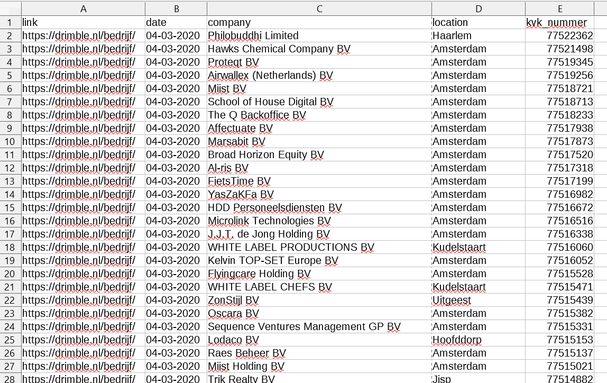

Web scraper for [drimble.nl](https://drimble.nl/bedrijf).
The app is implemented in Python using Scrapy. It reads the latest 100 pages and produces a csv file like the following.

 
Additionally, I created a simple web app using Flask to display the data nicely.

The web app called **askacompany**, reads the csv file (created by Scrapy), saves it into a database and display the content (see image below).

# My Contribution  
Solo developer.

# Technologies
Python 3, Flask, Scrapy

# Where
In a private repo.